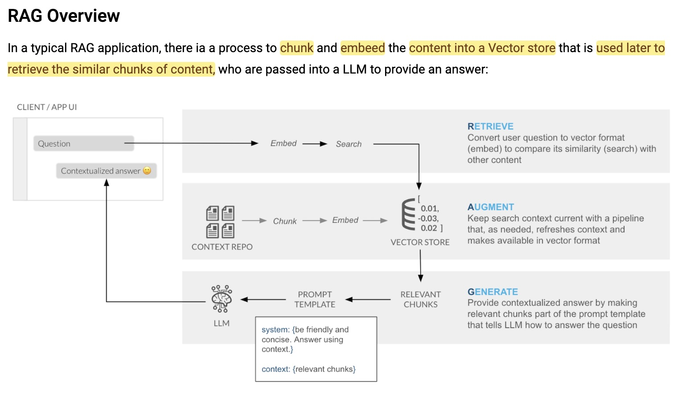

# Rust Documentation RAG Assistant

A Retrieval-Augmented Generation (RAG) application that helps developers learn Rust programming language by providing contextual answers from documentation.

[](./public/rag-overview.jpg)

## Overview

This application uses:

- Snowflake Cortex for vector embeddings and search
- Streamlit for the user interface
- TruLens for RAG evaluation
- Large Language Models for generating responses

## Prerequisites

- Python 3.11+
- Snowflake account with Cortex enabled
- Environment variables set up in `.env` file

## Installation

1. Clone the repository:

```bash
git clone https://github.com/kevinjaypatel/snowflake-rag-chat-app.git

cd snowflake-rag-chat-app
```

2. Create and activate a conda environment:

```bash
conda create -n rag-env python=3.11
conda activate rag-env
conda install -c https://repo.anaconda.com/pkgs/snowflake snowflake-snowpark-python snowflake-ml-python snowflake.core notebook ipykernel

pip install trulens-core trulens-providers-cortex trulens-connectors-snowflake llama-index llama-index-embeddings-huggingface llama-index-readers-github snowflake-sqlalchemy
```

3. Install the dependencies:

```bash
pip install -r requirements.txt
```

4. Set up the environment variables:

```bash
cp .env.example .env
```

## Usage

1. Start the Streamlit application:

```bash
streamlit run main.py
```

2. Use the sidebar to:

   - Select your LLM model
   - Choose document categories
   - Enable/disable chat history
   - Toggle RAG context
   - View debug information

3. Ask questions about Rust programming in the chat interface

## Features

- 💬 Interactive chat interface
- 📚 Context-aware responses from Rust documentation
- 🔍 Semantic search using Snowflake Cortex
- 📊 RAG evaluation metrics using TruLens
- 🔄 Chat history support
- 🎯 Category-specific document filtering

## Project Structure

```
.
├── main.py             # Streamlit application

├── rag.py              # RAG implementation

├── search.py           # Search Retrieval

├── snowflake_setup.py  # Snowflake connection

└── rag_feedback.py     # TruLens Feedback Functions
```

## Contributing

Contributions are welcome! Please feel free to submit a Pull Request.

## License

[MIT](LICENSE)
